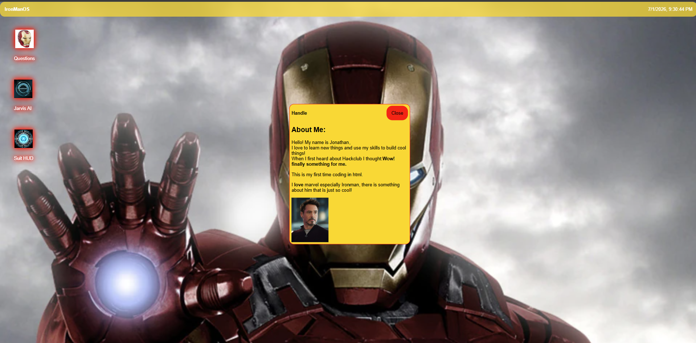

# IronManOS
*A browser operating system for people who really like Iron Man*

### [Try it live](https://raczjonathan12.github.io)

## Features
- A desktop environment with draggable, closable windows
- A quiz app to test how much you love Iron Man
- A Jarvis AI app that plays a video response when triggered
- An animated Suit HUD with updating power diagnostics, a spinning arc reactor, and simulated environmental readouts

## How it works
The Suit HUD simulates a boot sequence using staggered `setTimeout` calls and CSS transitions, and randomizes its diagnostic values on every open to feel alive rather than static.

## Credits
Built for Hack Club Stardance. Background and character images sourced from Google Images; arc reactor icon generated with Gemini.